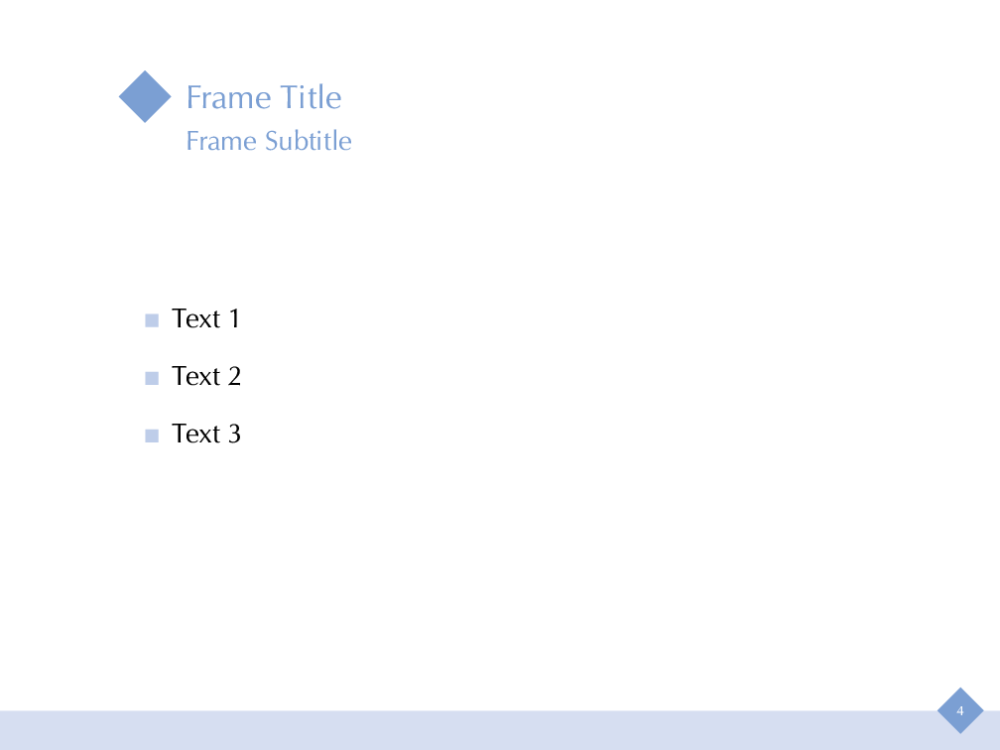

# sapphire-beamer
A simple beamer theme.

This theme uses URW classico font. The package can be downloaded from https://ctan.org/pkg/classico.

The sample file includes a suggested color box format and example of arrow overlay for equations.

  
  
  
  
  
  
  
